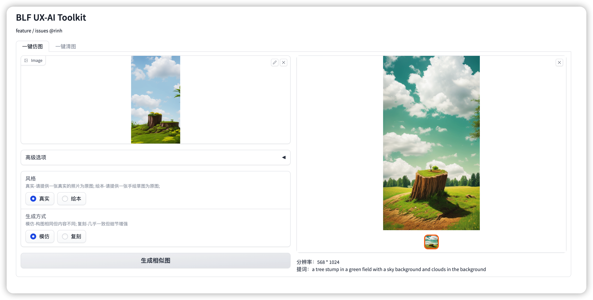

# SD-BLF

Stable diffusion webui使用起来还是麻烦，利用其API做的一键工具更方便使用。

PS: 运行的话还是需要部署依赖服务哈。

## 一键仿图

### 依赖 https://github.com/vladmandic/automatic

效果见



## 一键清图

### 依赖 https://github.com/rinh/Inpaint-Anything

1. 下载模型

```shell
git checkout https://github.com/rinh/Inpaint-Anything rinh-Inpaint-Anything
cd rinh-Inpaint-Anything
mkdir models

# sam
wget https://dl.fbaipublicfiles.com/segment_anything/sam_vit_h_4b8939.pth -o models/sam/sam_vit_h_4b8939.pth

# lama
# 打开 https://disk.yandex.ru/d/ouP6l8VJ0HpMZg
# 下载 big-lama.zip 
# 解压到 models/lama 中
```

3. 安装环境

python>=3.8

```shell
# windows  

pip install torch torchaudio torchvision --index-url https://download.pytorch.org/whl/cu118 
pip install fastapi gradio
pip install -e segment_anything
pip install -r lama_requirements_windows.txt


```